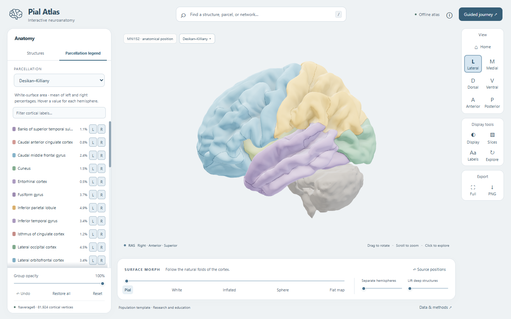

<div align="center">
  
  <h1>Pial Atlas</h1>
  <p><strong>An offline, interactive 3D atlas of the human brain built on real neuroimaging templates.</strong></p>
  <!-- The GitHub stars and last-commit badges require a publicly accessible repository. -->
  <p>
    <a href="LICENSE"></a>
    <a href="https://github.com/luminolous/pial-atlas/stargazers"></a>
    <a href="https://github.com/luminolous/pial-atlas/commits"></a>
    <a href="https://github.com/mrdoob/three.js/releases/tag/r180"></a>
  </p>
  <p>Standing on the shoulders of <a href="https://surfer.nmr.mgh.harvard.edu/fswiki/FsAverage">FreeSurfer fsaverage</a>, the <a href="https://surfer.nmr.mgh.harvard.edu/fswiki/CorticalParcellation_Yeo2011">Yeo 2011 network parcellations</a>, and the <a href="https://nist.mni.mcgill.ca/icbm-152-nonlinear-atlases-2009/">MNI152 template</a>.</p>
</div>

Open the included [dist/Pial-Atlas.html](dist/Pial-Atlas.html) in Chrome or Edge. Download the file first if you are viewing it on GitHub. It needs no server or installation; closing the tab closes the app. To build from source, install Node.js and npm, then run:

```sh
git clone https://github.com/luminolous/pial-atlas.git
cd pial-atlas
npm ci
npm run build
Start-Process '.\dist\Pial-Atlas.html' # Open dist/Pial-Atlas.html in your browser.
```



---

## Why

A static atlas figure fixes the viewing angle and the anatomical boundaries. Desktop neuroimaging tools provide more control, but require installation and dataset setup before a reader can explore the anatomy.

Pial Atlas puts FreeSurfer surfaces, cortical annotations, deep structures, and an MNI population template into one offline browser file. Switch parcellations on the same cortex, follow a named parcel through surface morphs, and compare anatomical positions with MRI slices.

## Features

- **Anatomical navigation** - Browse from Brain through divisions, hemispheres, and lobes to named parcels, or search across every scheme.
- **Switchable parcellations** - Change between Desikan–Killiany, Destrieux, Yeo 7, and Yeo 17 without reloading cortical geometry.
- **Surface morphing** - Move between pial, white, inflated, spherical, and derived flat representations while preserving parcel selection and visibility.
- **Deep anatomy** - Select separate aseg meshes and lift them into spaced groups, or separate the hemispheres with an independent slider.
- **Camera controls** - Rotate, pan, zoom, focus a selection, or animate to home, lateral, medial, dorsal, ventral, anterior, and posterior views.
- **Structure inspection** - Read a selection's hemisphere, scheme, hierarchy, and dataset, then focus, isolate, hide, or navigate to its parent.
- **Visibility and undo** - Hide hemispheres, groups, structures, or parcels; adjust group opacity; undo changes; restore visibility; or reset the atlas.
- **Area legend** - Inspect white-surface area percentages, filter longer legends, and toggle each label's left and right visibility independently.
- **Display controls** - Choose anatomical colours, porcelain, wireframe, or glass; toggle sulcal shading; or use the optional colourblind-safe palette.
- **MRI clipping** - Adjust sagittal, coronal, and axial clipping planes with reverse directions, MNI coordinates, and matching textured T1 slices.
- **Guided exploration** - Follow a journey through the lobes, inflation, networks, and deep structures, with labels and optional automatic rotation.
- **Offline export** - Enter fullscreen or save the current brain viewport as a PNG with dataset attribution and the Pial Atlas watermark.
- **Reduced motion** - The app respects the operating system's reduced-motion preference for transitions and automatic rotation.

## Data sources and licences

**The MIT code licence does not replace the data licences.** The standalone HTML embeds the dataset and runtime notices; their source copies are in [licenses/](licenses/).

| Dataset | What it provides | Licence | Source |
| --- | --- | --- | --- |
| FreeSurfer fsaverage6 | Pial, white, inflated, and spherical surfaces; per-vertex `sulc` values | [FreeSurfer Software License](licenses/FREESURFER.txt) | [Official distribution](https://surfer.nmr.mgh.harvard.edu/pub/dist/freesurfer/tutorial_versions_centos6/freesurfer/subjects/fsaverage6/) |
| Desikan–Killiany and Destrieux | `aparc` and `aparc.a2009s` cortical annotations on fsaverage6 | [FreeSurfer Software License](licenses/FREESURFER.txt) | [Cortical parcellation documentation](https://surfer.nmr.mgh.harvard.edu/fswiki/CorticalParcellation) |
| Yeo 2011 | 7- and 17-network annotations and ordered network names | [FreeSurfer terms](licenses/FREESURFER.txt) for the distributed annotations; [CBIG MIT](licenses/CBIG-MIT.txt) notice retained | [Yeo/CBIG project](https://github.com/ThomasYeoLab/CBIG/tree/master/stable_projects/brain_parcellation/Yeo2011_fcMRI_clustering) |
| FreeSurfer fsaverage aseg and T1 | Deep structures, ventricles, brainstem, cerebellum, and the T1 used for registration | [FreeSurfer Software License](licenses/FREESURFER.txt) | [Official MRI files](https://surfer.nmr.mgh.harvard.edu/pub/dist/freesurfer/tutorial_versions_centos6/freesurfer/subjects/fsaverage/mri/) |
| MNI152 ICBM 2009c nonlinear asymmetric | T1 slice volume and registration mask, using TemplateFlow's 2 mm distribution | [McGill/MNI permissive notice](licenses/MNI.txt) | [MNI dataset](https://nist.mni.mcgill.ca/icbm-152-nonlinear-atlases-2009/), [TemplateFlow mirror](https://github.com/templateflow/tpl-MNI152NLin2009cAsym) |

Source URLs, byte counts, and SHA-256 hashes are recorded in [data/sources.json](data/sources.json). [Data provenance](docs/DATA_SOURCES.md) documents the redistribution decisions. No requested dataset was excluded. The supplementary BrainCOLOR protocol PDF is not redistributed because its terms restrict copying.

### Imported data

These counts come from [reports/build.json](reports/build.json). Parcel counts distinguish the hemispheres; network labels are not split into connected components.

| Item | Count |
| --- | ---: |
| Unique cortical vertices | 81,924 total; 40,962 per hemisphere |
| Cortical triangles | 163,840 |
| Imported surface states | 8, across 2 shared cortical meshes |
| Derived flat maps | 2 |
| Desikan–Killiany parcels | 68 |
| Destrieux parcels | 148 |
| Yeo 7 labels | 14 hemisphere-specific labels |
| Yeo 17 labels | 34 hemisphere-specific labels |
| Additional unassigned / medial-wall labels | 10 |
| Selectable aseg meshes | 27, with 62,754 triangles |

The checked-in standalone HTML is **5,368,663 bytes (5.37 MB)**. The build report records its exact size and SHA-256; rebuilt sizes can differ with source line endings.

### Colours and area measurements

Desikan–Killiany and Destrieux use original application display colours defined in [pipeline/preprocess.py](pipeline/preprocess.py), rather than the annotation tables' RGB values. Yeo schemes retain their imported annotation colours. Deep structures use warm grey in cortical views and their FreeSurfer aseg colours during lift, direct selection, or navigation into their structure group.

The optional **Colourblind-safe palette** uses [Paul Tol's muted qualitative colours](https://sronpersonalpages.nl/~pault/), with the [BSD 3-clause notice](licenses/Paul-Tol.txt) retained. The app assigns colours using parcel adjacency. It reuses colours in larger schemes, so colour alone cannot identify every parcel or guarantee discrimination for every viewer.

Curvature shading uses the corresponding fsaverage6 `sulc` values in every surface state. It changes linear luminance multiplicatively before selection dimming, preserving parcel colour ratios. It represents FreeSurfer average convexity, not depth in millimetres.

Legend percentages use triangle areas on the native white surface before display transforms. Each hemisphere's denominator excludes its medial wall and unassigned labels. The row displays the mean of left and right percentages; the tooltip reports each hemisphere separately.

## How it works

1. **Preprocess the datasets.** [pipeline/fetch.py](pipeline/fetch.py) retrieves the reviewed inputs and verifies their hashes. [pipeline/preprocess.py](pipeline/preprocess.py) validates matching fsaverage6 topology, decodes annotations, derives flat maps, and extracts aseg meshes with marching cubes and centroid-preserving smoothing. It writes typed buffers to `build/`; the JavaScript build compresses geometry with meshoptimizer and embeds the assets in the HTML.
2. **Align coordinate spaces.** fsaverage surfaces begin in MNI305 surface/tkReg RAS. A saved affine, initialized from FreeSurfer's MNI305-to-MNI152 transform and refined against the target T1, maps them into MNI152NLin2009cAsym RAS. Aseg voxels pass through their tkReg affine and the same saved transform. Slice planes use the MNI volume affine. [data/alignment.json](data/alignment.json) contains the matrices; [the alignment montage](reports/alignment.png) shows the spatial comparison.
3. **Render labels on shared geometry.** Each hemisphere carries per-vertex integer labels for every scheme. Shader lookups supply colours and filtered boundary lines; picking returns label IDs. Morph targets retain vertex correspondence across surface states, and persistent visibility masks survive scheme, layout, and material changes.

Lobe membership follows [FreeSurfer's published Desikan–Killiany mapping](https://surfer.nmr.mgh.harvard.edu/fswiki/CorticalParcellation#Lobe_mapping). Destrieux navigation uses measured overlap with those groups, disclosed in the inspector. Yeo labels remain under Distributed networks. See [the architecture notes](docs/ARCHITECTURE.md) for rendering, coordinates, and layer interfaces.

## Project structure

```text
pial-atlas/
├── assets/           # README brain logo exported from the app glyph.
├── data/             # Compressed assets, source hashes, and coordinate transforms.
├── dist/             # Standalone offline Pial-Atlas.html.
├── docs/             # Architecture, provenance, validation, and the hero screenshot.
├── licenses/         # Dataset, runtime, and palette notices.
├── pipeline/         # Python downloads, anatomy mapping, and preprocessing.
├── reports/          # Build metadata, test results, and visual evidence.
├── scripts/          # Build, release packaging, and verification tools.
├── src/              # Three.js renderer, state, UI, shaders, and styles.
├── tests/            # Geometry, compression, state, and browser checks.
├── package-lock.json # Locked JavaScript dependency graph.
└── requirements.lock # Hash-pinned Python dependency graph.
```

Raw downloads live in ignored `.cache/raw/`; intermediate buffers live in ignored `build/`. Dependencies and local environments are not committed.

## Development

### Build the app

The commands in the opening build from the shipped processed assets. Python and raw downloads are not needed for that path. The build writes `dist/Pial-Atlas.html` and `reports/build.json`.

Command verification used Node.js 22.15.0, npm 11.3.0, and Python 3.13.0 on Windows. The browser needs WebGL 2, WebAssembly, and `DecompressionStream`; automated browser checks use Chrome. Other browser engines have not been independently verified.

| JavaScript dependency | Locked version |
| --- | --- |
| Three.js | 0.180.0 |
| meshoptimizer | 0.24.0 |
| esbuild | 0.25.10 |
| Playwright | 1.55.1 |

These versions come from [package-lock.json](package-lock.json). Python versions and package hashes are in [requirements.lock](requirements.lock).

### Run application tests

With an installed Google Chrome:

```sh
npm test
```

This runs the state tests and all three browser suites. The browser tests open the standalone file with networking offline and fail on console errors or HTTP requests. They cover navigation, picking, visibility persistence, morphs, layouts, clipping, legends, palettes, camera controls, export, and reduced motion. Screenshots and JSON results go to `reports/`.

Set `BROWSER_CHANNEL=msedge` in your shell environment to select installed Edge. The suites are defined in [tests/](tests/); recorded results and their scope are documented in [docs/VALIDATION.md](docs/VALIDATION.md).

### Regenerate assets from source data

Create a Python environment from the repository root:

```sh
python -m venv .venv
```

Activate that environment using your shell's normal procedure so that `python` points to it, then run:

```sh
python -m pip install --require-hashes -r requirements.lock
python scripts/rebuild.py --from-raw
python -m pytest tests/test_geometry.py -q
node tests/compression.mjs
```

The rebuild driver downloads the inputs, runs preprocessing, and builds the HTML. It reuses the saved affine in `data/alignment.json`. The raw-data path needs network access for source files and licence notices, but no FreeSurfer executable or licence key. Geometry and compression tests need the raw cache and buffers produced by this step.

### Package the release

```sh
python scripts/package_release.py
```

This creates `artifacts/Pial-Atlas-source-and-app.zip` with the app, source, assets, documentation, notices, and selected reports. It excludes raw datasets, dependencies, caches, and local environments.

## Limitations

- The surfaces and MRI slices represent population templates, not an individual scan.
- MNI305-to-MNI152 alignment is approximate and affine; fine sulci and tissue boundaries do not match exactly.
- Parcellations are conventions that differ between schemes, not unique definitions of anatomical or functional boundaries.
- Inflation, spherical and flat views, separation, and lift change display geometry; compare MRI slices in the anatomical source position.
- Flat maps are derived projections with a masked seam, not imported FreeSurfer flat patches or distance-preserving maps.
- Categorical boundary filtering improves display edges without changing the source annotations; it is not a new parcellation.
- The app does not process individual scans, assign unsourced regional functions, or provide clinical measurements. It is not intended for clinical use and has no clinical validation.

## Roadmap

The renderer's `LayerRegistry` exposes coordinate-space and update hooks for additional layers. These layers are planned and **not implemented**:

- White-matter tract trajectories.
- EEG electrode positions.
- Connectome nodes and edges.

## Citation and acknowledgements

Cite the datasets and methods when using their derivatives. The MNI dataset page requests both Fonov references below.

- **FreeSurfer surface averaging:** Fischl B, Sereno MI, Tootell RBH, Dale AM (1999). High-resolution intersubject averaging and a coordinate system for the cortical surface. *Human Brain Mapping*, 8(4), 272–284. [doi:10.1002/(SICI)1097-0193(1999)8:4&lt;272::AID-HBM10&gt;3.0.CO;2-4](https://doi.org/10.1002/%28SICI%291097-0193%281999%298%3A4%3C272%3A%3AAID-HBM10%3E3.0.CO%3B2-4).
- **Desikan–Killiany:** Desikan RS et al. (2006). An automated labeling system for subdividing the human cerebral cortex on MRI scans into gyral based regions of interest. *NeuroImage*, 31(3), 968–980. [doi:10.1016/j.neuroimage.2006.01.021](https://doi.org/10.1016/j.neuroimage.2006.01.021).
- **Destrieux:** Destrieux C, Fischl B, Dale A, Halgren E (2010). Automatic parcellation of human cortical gyri and sulci using standard anatomical nomenclature. *NeuroImage*, 53(1), 1–15. [doi:10.1016/j.neuroimage.2010.06.010](https://doi.org/10.1016/j.neuroimage.2010.06.010).
- **Yeo networks:** Yeo BT et al. (2011). The organization of the human cerebral cortex estimated by intrinsic functional connectivity. *Journal of Neurophysiology*, 106(3), 1125–1165. [doi:10.1152/jn.00338.2011](https://doi.org/10.1152/jn.00338.2011).
- **MNI152 template methods:** Fonov VS, Evans AC, McKinstry RC, Almli CR, Collins DL (2009). Unbiased nonlinear average age-appropriate brain templates from birth to adulthood. *NeuroImage*, 47(Supplement 1), S102. [doi:10.1016/S1053-8119(09)70884-5](https://doi.org/10.1016/S1053-8119%2809%2970884-5).
- **MNI152 template methods:** Fonov V, Evans AC, Botteron K, Almli CR, McKinstry RC, Collins DL; Brain Development Cooperative Group (2011). Unbiased average age-appropriate atlases for pediatric studies. *NeuroImage*, 54(1), 313–327. [doi:10.1016/j.neuroimage.2010.07.033](https://doi.org/10.1016/j.neuroimage.2010.07.033).

FreeSurfer, Thomas Yeo's group and CBIG, MNI/McGill, and TemplateFlow provide the anatomical foundations and distributions. Three.js supplies rendering, meshoptimizer supplies geometry compression, and Paul Tol supplies the optional palette values. The application's brain glyph is an original SVG defined in [src/brand.js](src/brand.js).

## Licence

The application source is [MIT-licensed](LICENSE), copyright 2026 Arkananta. Dataset licences remain separate as listed above. Preserve their notices when redistributing the data derivatives or standalone HTML.

All or portions of this licensed product (such portions are the "Software") have been obtained under license from The General Hospital Corporation and are subject to the terms and conditions reproduced in [licenses/FREESURFER.txt](licenses/FREESURFER.txt).

Runtime notices are in [THREE-MIT.txt](licenses/THREE-MIT.txt) and [MESHOPT-MIT.txt](licenses/MESHOPT-MIT.txt). The optional palette notice is in [Paul-Tol.txt](licenses/Paul-Tol.txt).
